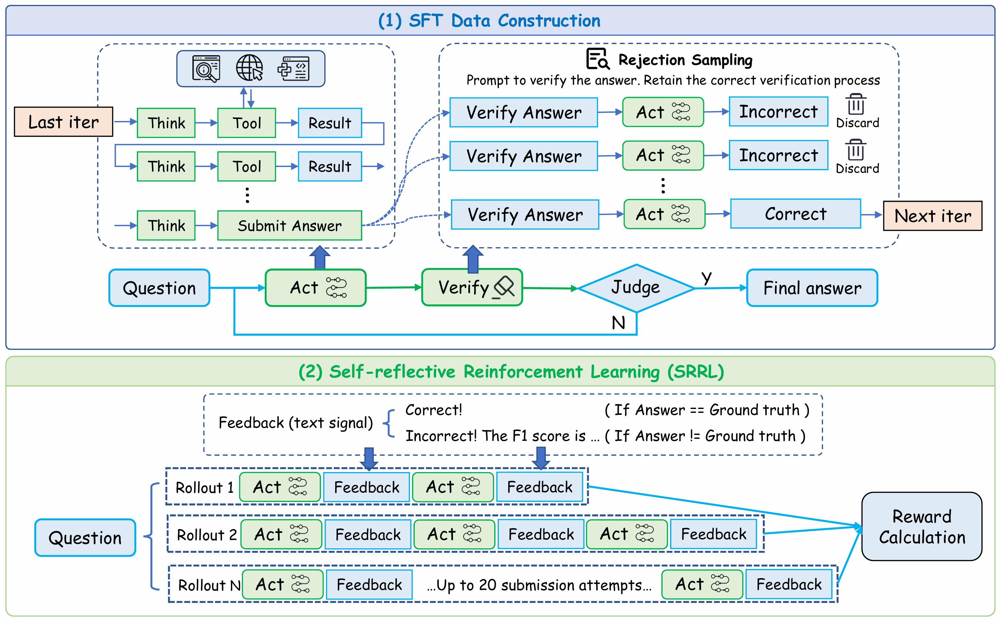
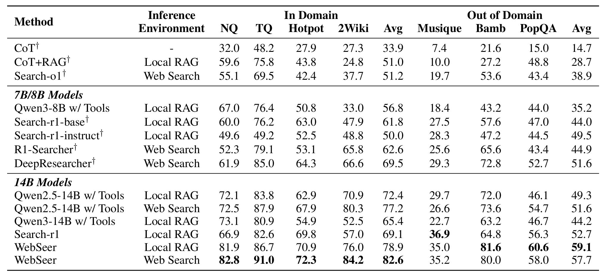

# WebSeer: Training Deeper Search Agents through Reinforcement Learning with Self-Reflection

---

**WebSeer** is a reinforcement learning framework for training intelligent web-based search agents capable of *deeper reasoning*, *longer tool-use chains*, and *self-reflective correction*.  
Unlike traditional Retrieval-Augmented Generation (RAG) systems, WebSeer integrates **self-reflection** into every stage of reasoning, enabling agents to backtrack, reformulate queries, and iteratively improve answers in real-world web environments.

<p align="center">
  
</p>

## 🤖 Model
| Model Name | Hugging Face Checkpoint | Size |
| ---------- | ----------------------- | :--: |
| WebSeer-14B | [🤗 WebSeer-14B](https://huggingface.co/99hgz/WebSeer-14b) | 14B |

## Inference

### Package Installation
We recommend using `uv` for environment management:

```bash
uv venv test_inf --python=3.10
source test_inf/bin/activate
uv pip install flask elasticsearch requests-cache requests urllib3 google-cloud-discoveryengine fanoutqa gunicorn openai jsonlines regex multiprocess pebble
uv pip install vllm --torch-backend=auto
```

### Start retrieval server

We use Serper to retrieve Google search results. You need to add your Serper API key in the `server_w_ws.py` file.

```bash
gunicorn -w 4 -b 0.0.0.0:21021 server_w_ws:app --timeout 120
```

### Launch the Inference Engine
Replace `PATH_TO_MODEL` with your local or remote model path/checkpoint.

```bash
vllm serve --host 0.0.0.0 --port 20090 PATH_TO_MODEL --served-model-name 'WebSeer-14b' --enable-auto-tool-choice --tool-call-parser hermes --reasoning-parser deepseek_r1 --tensor-parallel-size 1 --rope-scaling '{"rope_type":"yarn","factor":4.0,"original_max_position_embeddings":32768}' --max-model-len 131072
```

### Quick Inference Demo
```bash
python demo_inference.py
```

## Training

### Data Preparation
```bash
git clone https://huggingface.co/datasets/99hgz/WebSeer-sft-dataset ~/data/re_rag/
git clone https://huggingface.co/datasets/99hgz/WebSeer-dataset ~/data/re_rag_rl/
```

### SFT

```bash
uv venv webseer --python=3.10
source webseer/bin/activate
git clone https://github.com/GAIR-NLP/DeepResearcher.git
cd DeepResearcher
uv pip install torch==2.4.0 --index-url https://download.pytorch.org/whl/cu124
uv pip install flash-attn --no-build-isolation
uv pip install -e .
bash ./sft/recipe/retool/run_qwen2.5_14b_sp4.sh
```

### RL

```bash
gunicorn -w 4 -b 0.0.0.0:21021 server_w_ws:app --timeout 120    # start retrieval server
bash ./tests/e2e/run_re_rag.sh
```

## Evaluation

<p align="center">
  
</p>

We provide model outputs in the `outputs` directory. Complete evaluation scripts will be released later.

## 🤝 Acknowledgements

This training implementation is based on [`verl`](https://github.com/volcengine/verl). The base model is [`Qwen2.5`](https://qwenlm.github.io/blog/qwen2.5/).

## 📚 Citation
If you find this work useful, please cite it as follows: